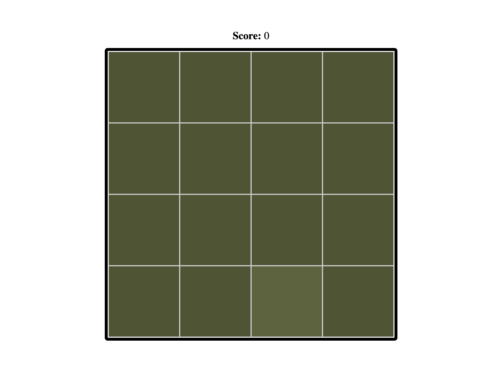
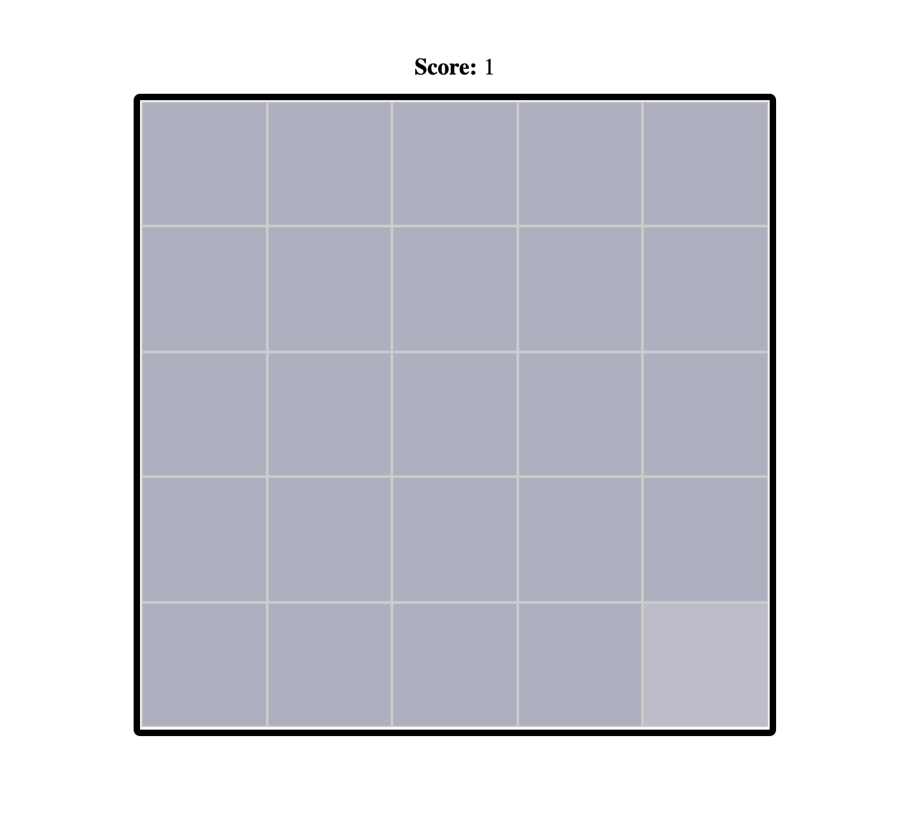
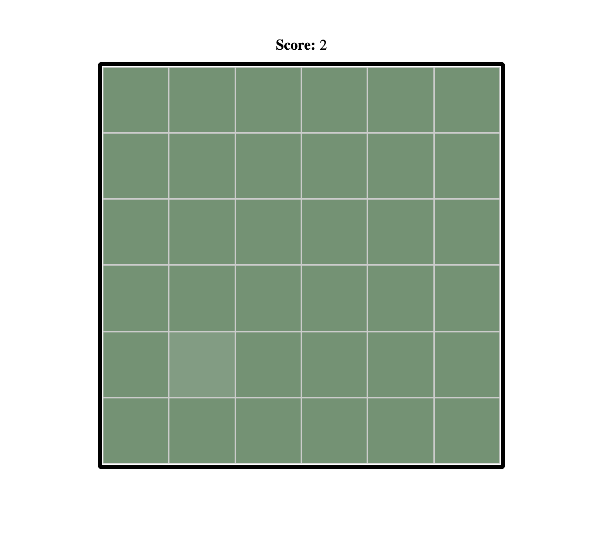

### Challenge 4: Color Spotter

Create a color spotter game using HTML, CSS and Vanilla Javascript, where you have to identify the cell that is different from the rest.

First, you start out with 4x4 grid, and click on the one where the shade looks slightly different. 

Each time you pick the correct cell, a new set of NxN grid is shown and you must once again pick the cell that stands out to you as different.

**Submit:** [challenges.devkode.io](challenges.devkode.io)

**Time Duration:** 90 minutes

#### Rules:
- Grid should be NxN and should starts from 4x4.
- In case of right answer, increment score by 1 and increase the size of grid by 1.
- In case of wrong answer reset score and grid to default and shake the grid for 800ms.

#### Instructions:
- No need to focus on responsiveness.
- No use of any library or framework.
- Code should be well structured with optimised solution.

- Use only https://jsfiddle.net/

### Demo








### HINT

> CSS

```
.shake {
    animation: shake 0.8s infinite;
    transform: translate3d(0, 0, 0);
}

@keyframes shake {
    0% {transform: translateX(0);} 
    10%, 30%, 50%, 70%, 90% {transform: translateX(-8px);} 
    20%, 40%, 60%, 80%,100% {transform: translateX(8px);} 
 } 
```


> JavaScript - Random Color Generator

```
const getRandomColors = function(){
    var ratio = 0.618033988749895;
    
    var hue = (Math.random() + ratio) % 1;
    var saturation = Math.round(Math.random() * 100) % 85;
    var lightness = Math.round(Math.random() * 100) % 85;

    var color = 'hsl(' + Math.round(360 * hue) + ',' + saturation + '%,' + lightness + '%)';
    var oddColor = 'hsl(' + Math.round(360 * hue) + ',' + saturation + '%,' + (lightness + 5) + '%)';

    return {
        color,
        oddColor
    }
}
```


All the best :) 


<br />

[Telegram](http://t.me/teamdevkode) | [Instagram](https://www.instagram.com/devkode.io/) | [Website](https://learn.devkode.io/)
